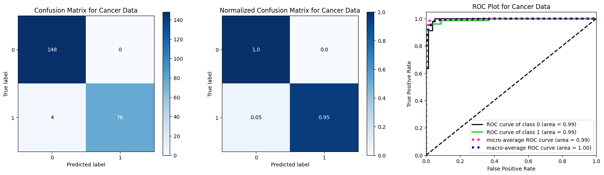

# 100 days of Machine learning
Join the 100 Days of ML Challenge and improve your machine learning skills by completing 100 projects in 100 days. This GitHub repository provides a comprehensive list of project ideas, ranging from beginner to advanced level, to help you build a strong foundation and mastery in ML.

## [Day 01: Breast Cancer Wisconsin (Diagnostic) Data Set](00_Breast_Cancer_Prediction/)

### Title: Classification of Breast Cancer Diagnosis using Logistic Regression

### Objective: 
The goal of this project is to develop a machine learning model that can accurately classify the diagnosis of breast cancer as either benign or malignant based on various diagnostic measurements.

### Outcome:

The first row represents the actual benign cases. Out of these, 148 were correctly classified as benign, and `0 were incorrectly classified as malignant`. The second row,represents the actual malignant cases. Out of these, `4 were incorrectly classified `as benign, and 76 were correctly classified as malignant.

In this particular case, the classifier has a high accuracy of `97.5% (148 + 76) / (148 + 76 + 4 + 0)`. However, this accuracy score may not be representative of the classifier's performance when it comes to real-world applications.

In conclusion, for cancer prediction, it's crucial to consider both accuracy scores and the distribution of false negatives and false positives. A high accuracy score alone may not be enough to guarantee that the classifier is providing reliable results. It's important to focus on reducing the number of `false negatives`, and to ensure that the classifier is providing an adequate number of `true positives`.

For cancer prediction, a high number of false negatives (FN) is particularly concerning. A false negative refers to a case where the classifier predicts the class label as benign, even though the actual class label is malignant. In this confusion matrix, there are 4 false negatives. This means that there are 4 cases where the classifier has missed a malignant tumor, which could have serious consequences for the patient.

In comparison, false positives (FP) are not as concerning, as they refer to cases where the classifier predicts a malignant tumor when the actual class label is benign. In this confusion matrix, there are 0 false positives.
